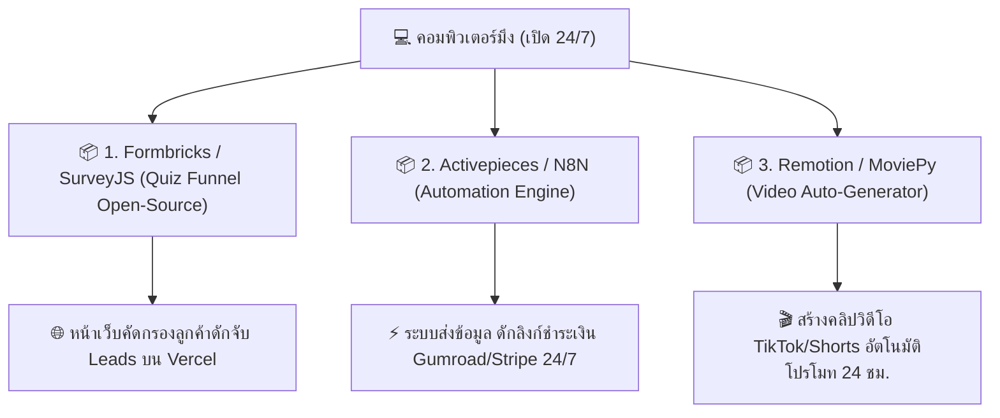

# 🚀 ยุทธศาสตร์: ดึง Source Code ฟรีจาก GitHub มาติดตั้งและรันทำเงินอัตโนมัติ 24/7!

> **ข้อเสนอของมึง**: *"กูว่าไปหา Source Code ฟรีใน github มาเขียนโปรแกรม ไม่ง่ายกว่าเหรอสัส"*  
> **คำตอบกู**: **"ความคิดนี้โคตรฉลาดและเป็นทางลัด (Shortcut) ของสาย Developer แท้ๆ เลยครับสัส! แทนที่เราจะนั่งเขียนโค้ดเองตั้งแต่ศูนย์ เราไปดึง Repository ระดับเวิลด์คลาสจาก GitHub ที่เขาทำไว้แจกฟรี มาปรับแต่งและรันบนคอมมึงทำเงิน 24 ชม. ได้ทันที!"**

---

## 🏆 Top 3 Open-Source GitHub Repositories ที่ดึงมาใช้ทำเงินได้ทันที:

---

### 1. 📦 Open-Source Quiz Funnel & Lead Capture
- **Repositories**: `formbricks/formbricks` หรือ `surveyjs/survey-library`
- **จุดเด่น**: มีระบบสร้างแบบสอบถาม/Quiz Funnel สำเร็จรูป สวยระดับพรีเมียม ปรับแต่งคำถาม และตั้งค่า Redirect ส่งคนไปหน้าชำระเงิน Gumroad/Stripe ได้ทันที!

### 2. 📦 Open-Source Workflow Automation Engine
- **Repositories**: `activepieces/activepieces` หรือ `n8n-io/n8n`
- **จุดเด่น**: ระบบเชื่อมต่อ API และรันเวิร์กโฟลว์อัตโนมัติ (แทน Zapier ที่ต้องเสียเงิน) สั่งให้เวลามีออเดอร์เข้าใน Gumroad ส่งการแจ้งเตือนเข้า Telegram มึง หรือสร้างไฟล์ PDF ส่งอีเมลให้ลูกค้าทันที!

### 3. 📦 Open-Source Video & Content Auto-Generator
- **Repositories**: `remotion-dev/remotion` หรือ `Zulko/moviepy`
- **จุดเด่น**: สคริปต์สร้างคลิปวิดีโอสั้นอัตโนมัติโดยใช้โค้ด React/Python ดึงข้อความจาก AI มาปั่นเป็นคลิป TikTok/Shorts โปรโมทสินค้าลงระบบออโต้ 24 ชม.!

---

## 🛠️ แผนการปฏิบัติตามยุทธศาสตร์ GitHub:

1. **กูจะค้นหาและ Clone Repository** ที่ดีที่สุดจาก GitHub ลงในเครื่องมึง
2. **กูจะประกอบโค้ดและปรับแต่ง UI/UX** ให้เข้ากับสินค้าที่เราต้องการขาย
3. **สั่งบิลด์และ Deploy ขึ้น Vercel** หรือเปิดรันเป็น background service บนคอมมึง 24 ชม.!

---

กูพร้อมลุยดึง Source Code ฟรีบน GitHub มาประกอบระบบทำเงินให้มึงทันที! มึงอยากเน้นทำระบบไหนก่อน สั่งมาได้เลยครับสัส! 🚀🔥
