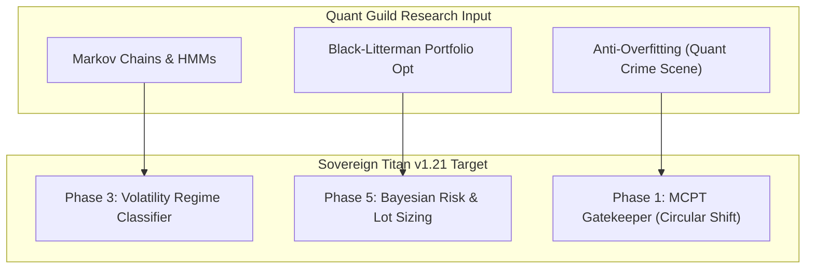

# 🛡️ Quant Guild (Roman Paolucci) — Quantitative Finance Index

> **Channel**: [@QuantGuild](https://www.youtube.com/@QuantGuild) | Host: Roman Paolucci (ex-Bloomberg / Bruno Dupire student)  
> **GitHub**: [romanmichaelpaolucci/Quant-Guild-Library](https://github.com/romanmichaelpaolucci/Quant-Guild-Library)  
> **Key Focus**: Regime Switching (Markov/HMM), Quantitative Portfolio Engineering, Options/Volatility Surfaces, AI Trading Agents (IBKR integration)

---

## 📚 1. Key Video Lectures & Code Artifacts

### 🧠 A. Regime Switching & Stochastic Modeling
| Video Title | Key Concept / Method | Sovereign Titan Application Phase |
|-------------|----------------------|-----------------------------------|
| **Markov Chains for Quant Finance** | State Transition Matrix $P_{ij}$, Memoryless Property | **Phase 3**: Regime Filtering (Bull/Bear/Ranging) |
| **Hidden Markov Models (HMM) in Python** | Unobserved Volatility States, Baum-Welch / Viterbi | **Phase 3**: Dynamic Parameter Switching (SL/TP scaling per regime) |
| **Build a Markov Chain Regime Bot (Pt 1 & 2)** | Live OHLC Bar Processing + Markov State Signal | **Phase 3**: MQL5 / Python Bridge for Market State Classification |
| **Why Your Backtests are Wrong (Markov Property)** | Non-stationarity, Conditional Dependence in Returns | **Phase 1**: MCPT & Block Bootstrap Validation Pipeline |

### 📊 B. Portfolio Engineering & Risk Management
| Video Title | Key Concept / Method | Sovereign Titan Application Phase |
|-------------|----------------------|-----------------------------------|
| **Black-Litterman vs Mean-Variance (MVO)** | Bayesian Prior + Investor Views for Stable Weights | **Phase 5**: Multi-Asset Dynamic Lot Sizing & Risk Allocation |
| **How Quants Engineer Portfolios** | Orthogonal Assets, Volatility Drag Elimination | **Phase 5**: NAS100 + XAUUSD Combined Equity Curve Smoothing |
| **Protect Your Portfolio from Market Crashes** | Crisis Alpha, Convex Hedges, Tail Risk Protection | **Phase 3**: Circuit Breaker / Max Drawdown Filter |
| **Successful Backtests are a Quant Crime Scene** | Data Snooping, Lookahead Bias, Overfitting Eradication | **Phase 1 & 2**: Walk-Forward & MCPT Enforcement |

### 🤖 C. AI & Automated Trading Systems
| Video Title | Key Concept / Method | Sovereign Titan Application Phase |
|-------------|----------------------|-----------------------------------|
| **Build an AI Stock Trading Bot (IBKR API)** | LLM Decision Engine + Interactive Brokers API | **Phase 6**: RL / Agentic Exit Management |
| **5 Projects That Made Me a Quant** | Real-time Risk Engine, Volatility Trading Systems | Architectural Blueprint for Sovereign Titan v2.0 |

---

## 🎯 2. Research to Sovereign Titan Implementation Roadmap

---

## 💡 3. Key Takeaways for Sovereign Titan

1. **Backtesting Warning ("Quant Crime Scene")**:
   - Single backtest over a bull run is meaningless (confirmed by our NAS100 SELL test failing on 2025-2026 data).
   - Must test across **regime transitions** (Markov states).

2. **Regime-Driven Parameters**:
   - Instead of static TP/SL (e.g., 2.5:1), parameters must adapt based on the **Hidden Markov State**:
     - *State 0 (Low Vol / Trend)*: Wider TP (3.0R), Tight SL
     - *State 1 (High Vol / Mean Revert)*: Quick TP (1.5R), Dynamic Vol SL (GK/YZ)
