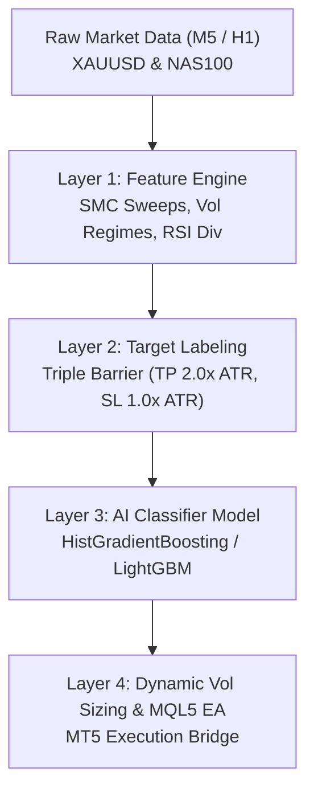

# 🤖 Architecture Blueprint: Sovereign Titan AI Engine

> **เป้าหมาย:** สร้างระบบ AI Trading สำหรับ **XAUUSD (ทองคำ)** และ **NAS100 (ดัชนีสหรัฐฯ)**  
> **แกนหลัก:** ผสาน SMC Liquidity Sweeps + Order Flow / Volatility Regimes + Machine Learning Classifier + Pure MQL5 Execution

---

## 🏗️ 4-Layer System Architecture

---

## 📊 Feature Matrix (12 Inputs)

1. **`uwick`**: Upper Wick Ratio (`(High - max(Open, Close)) / Range`)
2. **`lwick`**: Lower Wick Ratio (`(min(Open, Close) - Low) / Range`)
3. **`body`**: Body Ratio (`|Close - Open| / Range`)
4. **`vol_ratio`**: Current ATR(14) / 100-bar Average ATR
5. **`return_1b`**: 1-bar Momentum
6. **`return_5b`**: 5-bar Momentum
7. **`hour`**: Hour of Day (UTC) — Session Filter (London / NY Open)
8. **`pdh_sweep`**: High > Previous Day High & Close < PDH (SMC Sweep)
9. **`pdl_sweep`**: Low < Previous Day Low & Close > PDL (SMC Sweep)
10. **`rsi`**: Relative Strength Index 14
11. **`dist_sma50`**: Distance of Close to 50 SMA (normalized by ATR)
12. **`dist_sma200`**: Distance of Close to 200 SMA (normalized by ATR)

---

## 🎯 Verification Standard
- **Validation Split:** 70% Train / 30% Out-of-Sample Holdout
- **Per-Trade Sharpe Ratio:** `mean(R-returns) / std(R-returns)` (No fake annualization multiplier)
- **Target Expectancy:** > `+0.25R` per trade with Win Rate > `42%` at R:R 1:2.0

---

## 💻 Code Repositories
- Data Fetcher: `I:\Sovereign_Pure\43_nas100_data_fetcher.py`
- AI Model Trainer: `I:\Sovereign_Pure\42_xauusd_ai_titan_trainer.py`
- Dual-Asset Trainer: `I:\Sovereign_Pure\44_dual_asset_ai_titan.py`
